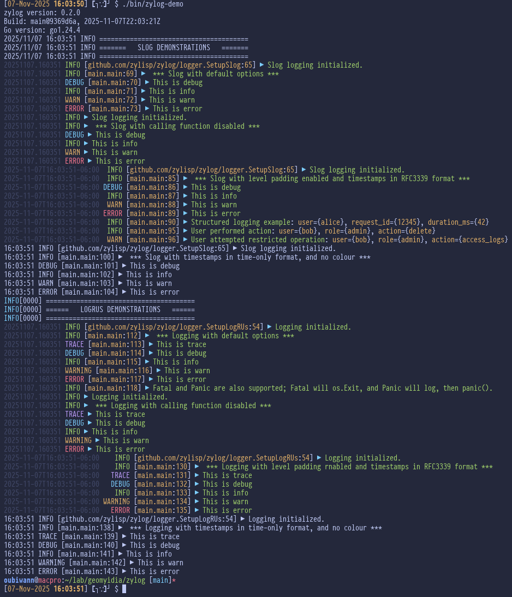

# zylog

[![Build Status][gh-actions-badge]][gh-actions]
[![Tags][github-tags-badge]][github-tags]

*A flexible logging wrapper supporting both slog and logrus with beautiful, consistent formatting*

## Features

- 🎨 Beautifully colored output with customizable colors
- 🔄 Support for both **slog** (Go standard library) and **logrus**
- 📍 Optional caller information (package, function, line number)
- ⏰ Multiple timestamp formats (RFC3339, Standard, Simple, Time-only)
- 📏 Configurable level padding for perfect alignment
- 🎯 Unified API for both logging backends
- ⚙️ Simple, minimal configuration

## Installation

```bash
go get github.com/zylisp/zylog
```

## Example Use

Run the comprehensive demo:

```bash
make demo
```

Or build and run manually:

```bash
make build
./bin/zylog-demo
```

At which point you should see something like the following:



See the demo code in  `cmd/zylog-demo/main.go` for examples of both logging backends.

## Quick Start

### Unified Setup (Recommended)

Use the unified `SetupLogging()` function to configure either logger:

```go
package main

import (
    "github.com/zylisp/zylog"
    "github.com/zylisp/zylog/formatter"
    "github.com/zylisp/zylog/options"
)

func main() {
    // Configure with slog (default)
    logger, err := zylog.SetupLogging(&options.ZyLog{
        Colored:         true,
        Level:           "info",
        Output:          "stdout",
        ReportCaller:    true,
        TimestampFormat: formatter.SimpleTimestamp,
        PadLevel:        true,
        PadAmount:       7,
        PadSide:         "left",
        Logger:          options.Slog, // or options.LogRUs
    })
    if err != nil {
        panic(err)
    }

    // For slog, use the returned logger
    if logger != nil {
        logger.Info("Application started")
        logger.Info("User logged in", "user_id", 12345, "ip", "192.168.1.1")
    }
}
```

### Using with slog

```go
import (
    "log/slog"
    "github.com/zylisp/zylog"
    "github.com/zylisp/zylog/options"
)

func main() {
    // SetupLogging returns the configured slog logger and sets it as default
    logger, _ := zylog.SetupLogging(options.Default())

    // Use the returned logger directly
    logger.Info("Application started")

    // Or use the default slog logger
    slog.Info("This also works")

    // Structured logging
    logger.Info("User action",
        slog.String("user", "alice"),
        slog.Int("request_id", 12345))
}
```

### Using with logrus

```go
import (
    log "github.com/sirupsen/logrus"
    "github.com/zylisp/zylog"
    "github.com/zylisp/zylog/options"
)

func main() {
    // For logrus, SetupLogging returns nil (uses global instance)
    opts := options.Default()
    opts.Logger = options.LogRUs
    _, _ = zylog.SetupLogging(opts)

    // Use global logrus instance
    log.Info("Application started")
    log.WithFields(log.Fields{
        "user": "alice",
        "request_id": 12345,
    }).Info("User action")
}
```

## Configuration Options

```go
type ZyLog struct {
    Colored         bool                // Enable colored output
    Level           string              // Log level: "trace", "debug", "info", "warn", "error"
    Output          string              // Output destination: "stdout", "stderr"
    ReportCaller    bool                // Include caller information
    TimestampFormat formatter.TSFormat  // Timestamp format
    PadLevel        bool                // Pad level strings for alignment
    PadAmount       int                 // Number of characters to pad to
    PadSide         string              // "left" or "right"
    MsgSeparator    string              // Separator between message and attributes
    Logger          options.Logger      // LogRUs or Slog
}
```

### Preset Configurations

```go
// Default configuration (slog with all features enabled)
opts := options.Default()

// Disable caller reporting
opts := options.NoCaller()
```

## Color Customization

Zylog allows you to customize the foreground and background colors of every formatted element. By default, zylog uses sensible color defaults, but you can override any color you want.

### Simple Example - Changing a Few Colors

```go
import (
    "github.com/fatih/color"
    "github.com/zylisp/zylog"
    "github.com/zylisp/zylog/colors"
    "github.com/zylisp/zylog/options"
)

func main() {
    opts := options.Default()

    // Customize just the colors you want to change
    opts.Colours.LevelError = &colors.Color{
        Fg: color.FgHiRed,
        Bg: color.BgYellow,  // Add yellow background to errors
    }
    opts.Colours.Message = &colors.Color{
        Fg: color.FgHiWhite,
        Bg: color.Reset,  // No background
    }

    logger, _ := zylog.SetupLogging(opts)
    logger.Error("This error has a yellow background!")
}
```

### Disabling Color for Specific Elements

To disable color for a specific element while keeping others colored, set both Fg and Bg to `color.Reset`:

```go
opts := options.Default()
opts.Colours.Timestamp = &colors.Color{
    Fg: color.Reset,
    Bg: color.Reset,
}
// Timestamp will now be uncolored, but everything else remains colored
```

### Complete Color Configuration Reference

The `Colours` struct provides fine-grained control over every colored element:

```go
type Colours struct {
    // Timestamp colors (default: HiBlack/grey)
    Timestamp *Color

    // Log level colors
    LevelTrace   *Color  // default: HiMagenta
    LevelDebug   *Color  // default: HiCyan
    LevelInfo    *Color  // default: HiGreen
    LevelWarn    *Color  // default: HiYellow
    LevelWarning *Color  // default: HiYellow
    LevelError   *Color  // default: Red
    LevelFatal   *Color  // default: HiRed
    LevelPanic   *Color  // default: HiWhite

    // Message text color (default: Green)
    Message *Color

    // Arrow separator " ▶ " (default: Cyan)
    Arrow *Color

    // Caller information colors
    CallerFunction *Color  // default: HiYellow
    CallerLine     *Color  // default: Yellow

    // Structured logging attribute colors
    AttrKey   *Color  // default: Yellow
    AttrValue *Color  // default: HiYellow
}

type Color struct {
    Fg color.Attribute  // Foreground color
    Bg color.Attribute  // Background color
}
```

Available color attributes from `github.com/fatih/color`:

**Foreground colors:**
- `color.FgBlack`, `color.FgRed`, `color.FgGreen`, `color.FgYellow`
- `color.FgBlue`, `color.FgMagenta`, `color.FgCyan`, `color.FgWhite`
- `color.FgHiBlack`, `color.FgHiRed`, `color.FgHiGreen`, `color.FgHiYellow`
- `color.FgHiBlue`, `color.FgHiMagenta`, `color.FgHiCyan`, `color.FgHiWhite`

**Background colors:**
- `color.BgBlack`, `color.BgRed`, `color.BgGreen`, `color.BgYellow`
- `color.BgBlue`, `color.BgMagenta`, `color.BgCyan`, `color.BgWhite`
- `color.BgHiBlack`, `color.BgHiRed`, `color.BgHiGreen`, `color.BgHiYellow`
- `color.BgHiBlue`, `color.BgHiMagenta`, `color.BgHiCyan`, `color.BgHiWhite`

**Special:**
- `color.Reset` - No color (use for both Fg and Bg to disable coloring for an element)

### Global Color Disable

The existing `Colored: false` option continues to work and will disable ALL colors regardless of individual color settings:

```go
opts := options.Default()
opts.Colored = false  // Disables all colors globally
```

## Timestamp Formats

Zylog supports multiple timestamp formats:

- `formatter.RFC3339` - Full RFC3339 format (e.g., `2025-11-07T14:30:45-08:00`)
- `formatter.StandardTimestamp` - Standard format (e.g., `2006/01/02 15:04:05`)
- `formatter.SimpleTimestamp` - Compact format: YYYYMMDD.HHmmSS (e.g., `20251107.143045`) **[Default]**
- `formatter.TimeOnly` - Time only: HH:mm:SS (e.g., `14:30:45`)

```go
opts.TimestampFormat = formatter.RFC3339         // 2024-11-07T14:30:52-05:00
opts.TimestampFormat = formatter.StandardTimestamp // 2006/01/02 15:04:05
opts.TimestampFormat = formatter.SimpleTimestamp  // 20241107.143052
opts.TimestampFormat = formatter.TimeOnly         // 14:30:52
```

## Output Format

```
20241107.143052    INFO [main.main:42] ▶ Application started
20241107.143052    WARN [auth.Login:127] ▶ Failed login attempt: user={alice}, ip={192.168.1.1}
```

## Logger Comparison

### slog (Recommended for new projects)

- ✅ Standard library (no external dependencies)
- ✅ Better performance
- ✅ Native structured logging
- ✅ Logger instances for better control
- ✅ Modern Go idioms

### logrus (For existing projects)

- ✅ Global singleton pattern
- ✅ Simpler for quick setup
- ✅ Wide ecosystem support
- ✅ Familiar to many Go developers

## Background

The formatting style is inspired by the [Twig Clojure](https://github.com/clojusc/twig) and [Logjam LFE](https://github.com/lfex/logjam) libraries.

## License

© 2019,2025 ZYLISP Project
© 2019-2025, geomyidia Project

Apache License, Version 2.0

[//]: ---Named-Links---

[gh-actions-badge]: https://github.com/zylisp/zylog/actions/workflows/cicd.yml/badge.svg
[gh-actions]: https://github.com/zylisp/zylog/actions
[github-tags]: https://github.com/zylisp/zylog/tags
[github-tags-badge]: https://img.shields.io/github/tag/zylisp/zylog.svg
